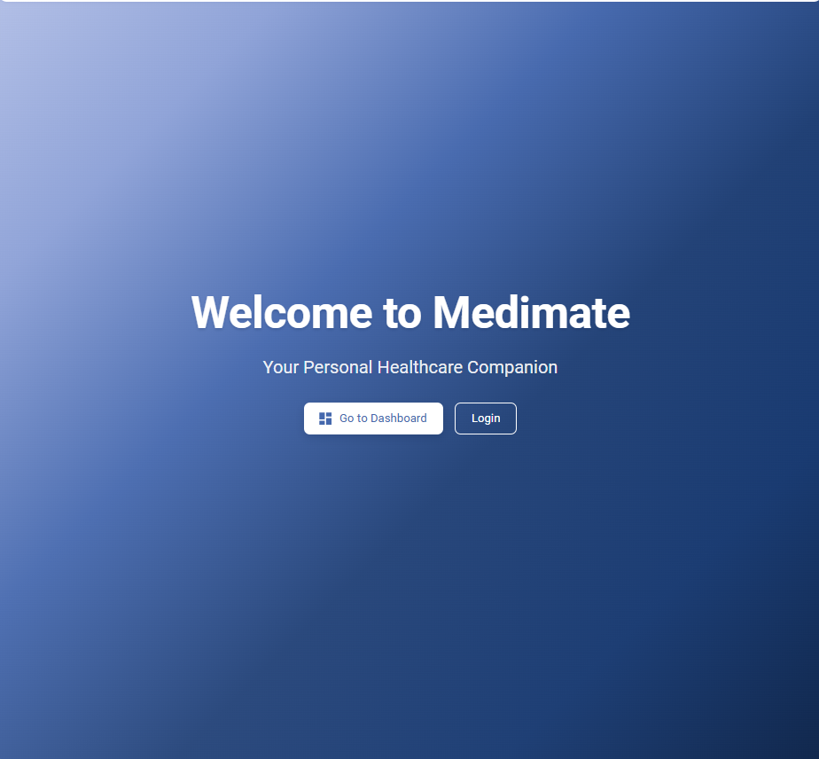
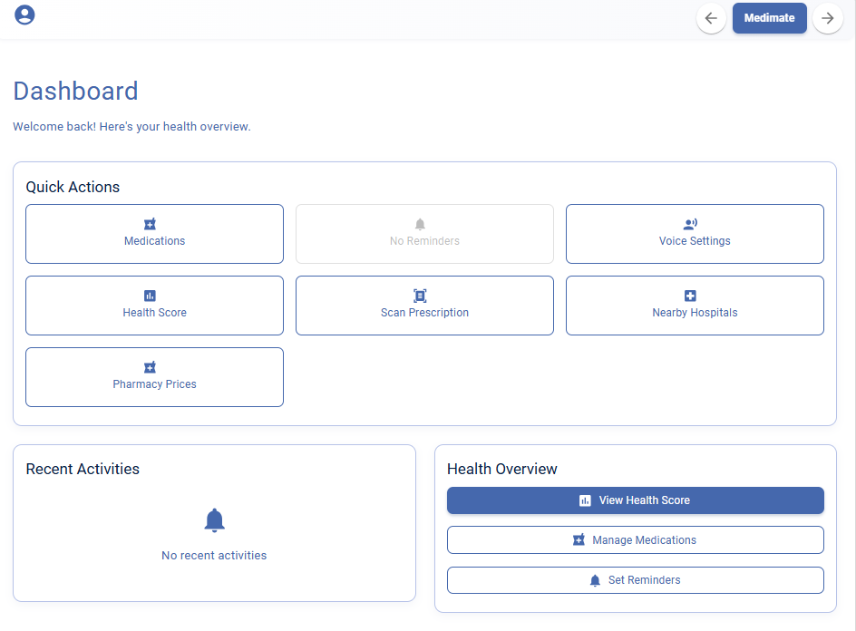
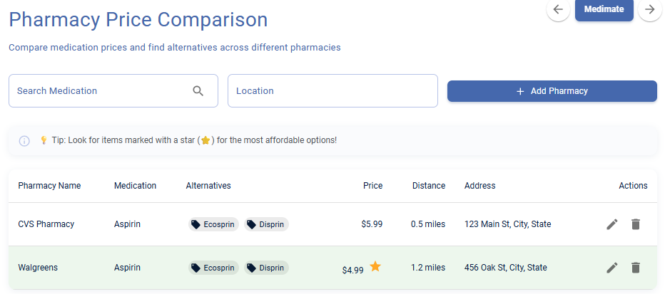

# 🩺 Medimate – Your Personal Healthcare Companion

Medimate is a modern, AI-assisted healthcare web application designed to simplify everyday health management. From tracking your health habits to scanning prescriptions and comparing medicine prices, Medimate brings multiple healthcare utilities into one clean and user-friendly platform.

---

## Features

### Health Score Dashboard

* Track your overall health performance
* Visualize adherence scores and daily habits
* Weekly insights to improve lifestyle consistency

---

### Prescription Scanner

* Upload prescriptions using image or file
* View and manage uploaded prescriptions
* Simplifies medicine tracking and understanding

---

### Nearby Hospitals

* Detect nearby hospitals using location access
* Quick access to healthcare facilities around you

---

### Voice Settings

* Enable voice notifications
* Customize reminder alerts for:

  * Medications
  * General health activities
* Adjustable voice speed and preferences

---

### Pharmacy Price Comparison

* Compare medicine prices across pharmacies
* Find affordable options easily
* View pharmacy details like location and availability

---

### Health Tips

* Daily health suggestions like:

  * Water intake reminders
  * Sleep recommendations
  * Activity tracking

---

### Profile & Settings

* Manage personal information
* Customize notification preferences
* Privacy and data control options

---

### Dashboard Overview

* Quick glance at:

  * Health score
  * Medication status
  * Daily progress
* Clean UI for better user experience

---

### Landing Page

* Welcoming interface with navigation to:

  * Dashboard
  * Login
* Smooth and responsive design

---

## Tech Stack

* **Frontend:** React (JSX)
* **Styling:** CSS / Modern UI components
* **Backend:** Node.js (if applicable)
* **Tools:** Cursor (AI-assisted development)

---

## Project Structure

```
Medimate/
│── src/
│   │── components
│   │── pages
│── screenshots
│── backend/
│── package-lock.json
│── package.json
│── vite.config.js
│── index.html
```

---

## Installation & Setup

### 1️⃣ Clone the repository

```
git clone https://github.com/YOUR-USERNAME/Medimate.git
cd Medimate
```

---

### 2️⃣ Install dependencies

```
npm install
```

---

### 3️⃣ Run the project

```
npm run dev
```

---

###  Open in browser

```
http://localhost:3000
```

---

## Environment Variables

Create a `.env` file in the root or backend folder if required:

```
PORT=your_port
MONGO_URI=your_mongo_uri_here
```

---

##  Screenshots

### Home Page


### Dashboard


### Pharmacy


---

## Notes

* `node_modules` is ignored for better performance
* `.env` files are excluded for security reasons
* Make sure backend services (if any) are running

---

## Future Enhancements

* AI-based health predictions
* Doctor appointment booking
* Real-time chat with healthcare assistants
* Integration with wearable devices

---

## Author

Developed by SRILEKHA GONDI ,SRIDIVYA and SRISHA as a project using AI-assisted tools and modern web technologies.

---

## Final Note

This project was a valuable learning experience, enabling us to gain practical knowledge, enhance our problem-solving abilities, and strengthen our development skills.
